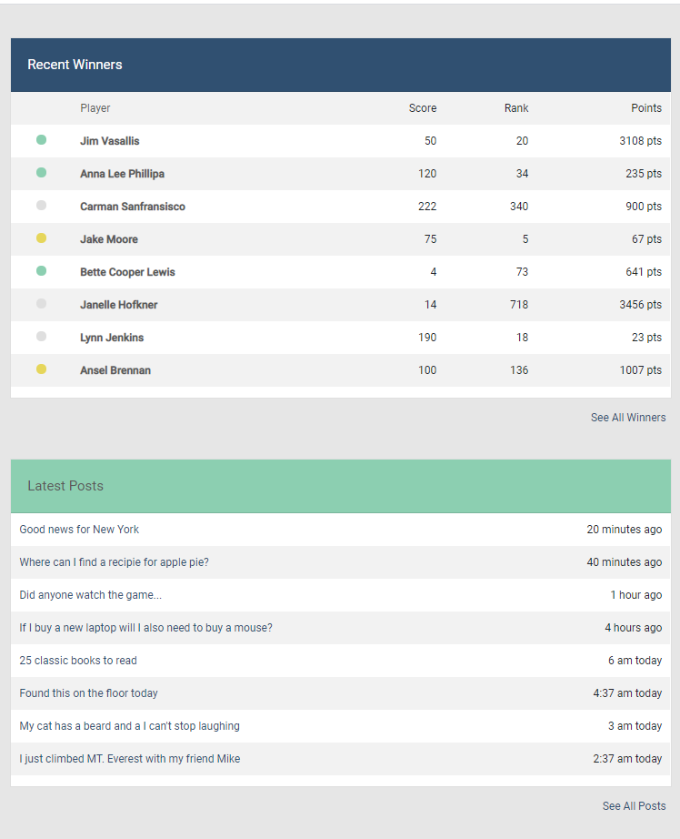
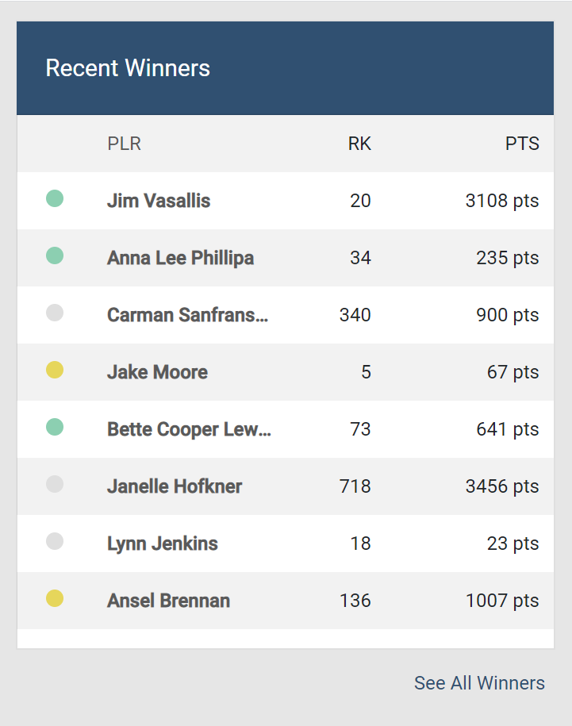
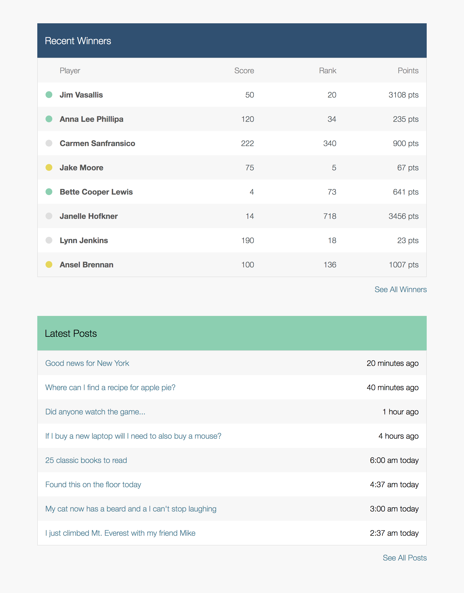
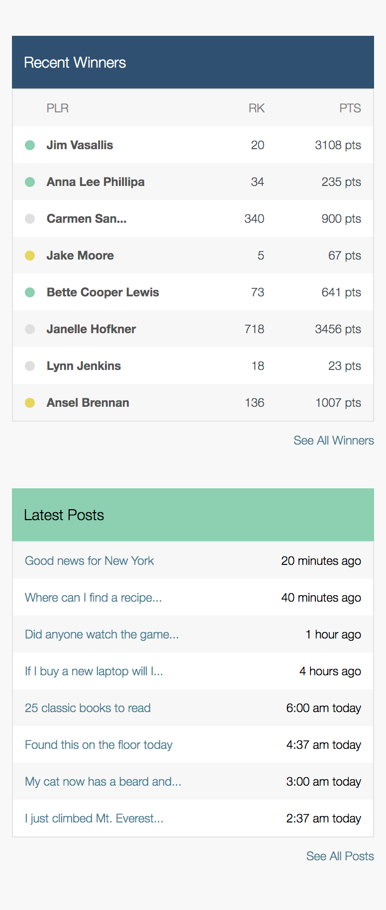

# Better Collective
#### wireframe work example.
> Responsive page built using html and css (scss) to the Best Collective specifications as part of an interview process.

Built from scratch in **VS code**, using the **bootstrap 4** css framework for it's responsive quailites .**Google fonts** are referenced. This has been tested in **chrome** in *desktop* and *mobile* views.

###### Note: If this were to be put into production the external references above would be downloaded and stored within the project.

#### Screenshots

#### Original Wirefames

#### 615 943 2197 |  thatcher@comsynth.com | https://github.com/comsynth/resume
